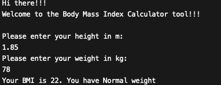
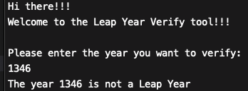
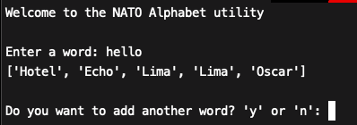
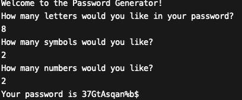

# Basic Python Scripts
- Basic command line python scripts used for learning.
    - BMI calculates Body Mass Index.
    - days_of_month checks how many days where in a certain month of any year.
    - is_it_a_leap_year verifies if a certain year was a leap year.
    - NATO_alphabet turns a word into separate NATO code words.
    - password_generator creates secure passwords.
    - prime_nums verifies if a number is a prime number.
    - rock_paper_scissors play against your computer.
    - tip_calculator helps to split a bill.
- Everything here was made with Python 3.9.0 and made to run directly on a terminal.

Ideas came from [this course.](https://www.udemy.com/course/100-days-of-code/)

Previews:
- 

- 

- 

- 

